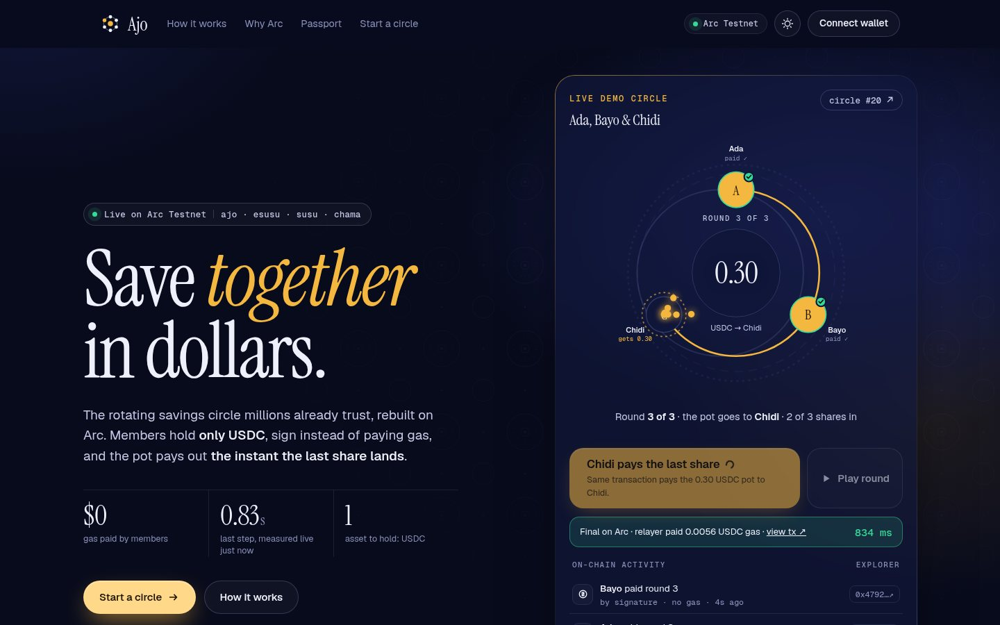
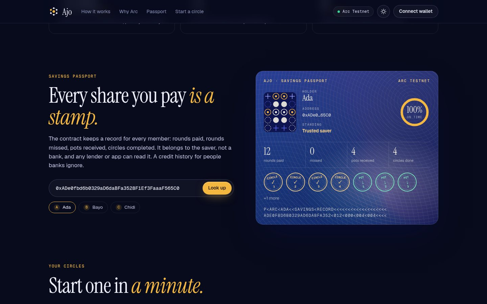
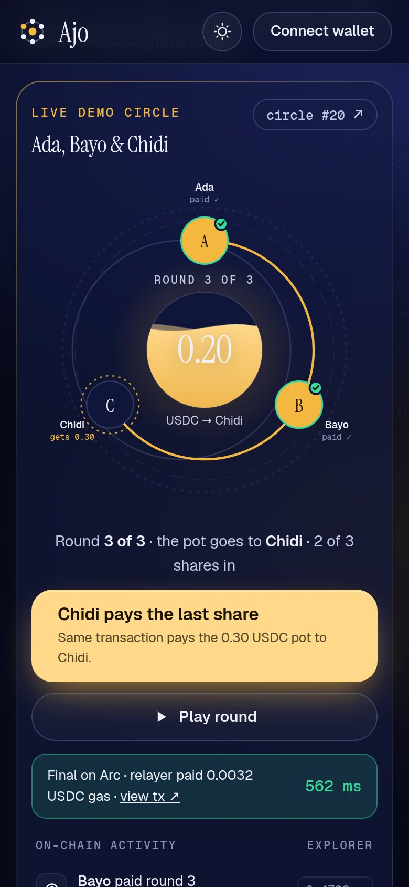
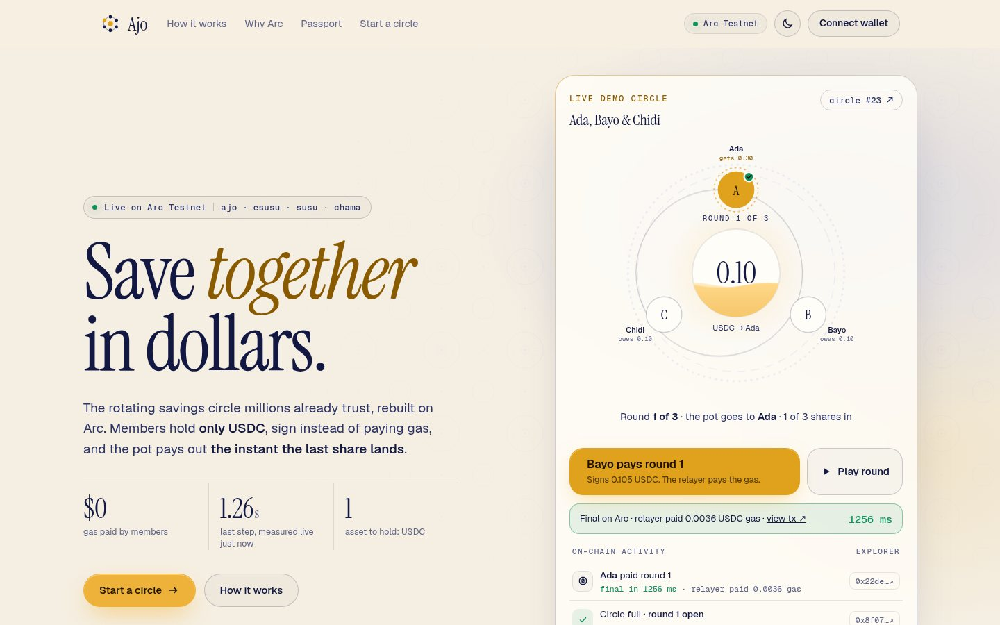

# Ajo · savings circles in USDC on Arc

**Live:** https://ajo-arc.vercel.app (Arc Testnet today; mainnet deployment below once live)



An *ajo* (also called esusu, susu, chama, tontine, tanda) is how millions of people save without a bank: a group agrees on an amount, everyone pays it every round, and each round the whole pot goes to one member until everyone has had a turn. It works because people trust each other. It breaks when someone is late, when the organizer holds the cash, or when the money loses value while it waits.

Ajo puts the circle on Arc:

- **Members hold only USDC.** On Arc, USDC is both the savings asset and the gas. Nobody needs a second, volatile token to move their dollars.
- **Every action is a signature, not a transaction.** Joining and contributing use USDC's EIP-3009 `receiveWithAuthorization`. A relayer submits the signature and is repaid a capped fee **in USDC, out of the signed amount**. That is only possible because gas on Arc is USDC.
- **The pot lands the moment the last share does.** The final contribution of a round pays the whole pot to that round's member in the same transaction. Arc finality is sub-second.
- **Nobody can stall the circle.** Each member puts down a security deposit. After a round's deadline anyone can call `settle`: missing shares are covered from deposits and the pot still goes out. Deposits come back automatically when the circle completes.
- **Saving builds a record.** The contract keeps a per-address savings record (rounds paid, rounds missed, pots received, circles completed) that any lender or app can read. A credit history that belongs to the saver, not a bank.

## Try it

The live demo circle is the homepage. Three demo members (Ada, Bayo and Chidi) sit on a ring around the pot and hold nothing but USDC. Press the button: the next member's authorization is signed on the server and the relayer submits it on Arc, exactly the path a real member's wallet signature takes. A stopwatch runs until the transaction is final, a coin drops into the pot, and when the last share of a round lands the pot streams to that round's member. Each step leaves a receipt with the time from submit to final receipt, the gas the relayer paid and an explorer link. **Play round** runs straight through to the next payout.

With a browser wallet on Arc you can also organize a circle (free, the relayer pays the gas), share its invite link, join by signature and pay each round by signature.

| Savings passport | On a phone | Light theme |
| --- | --- | --- |
|  |  |  |

**Savings passport.** Any address's on-chain record (rounds paid, rounds missed, pots received, circles completed) is rendered as a passport page with an on-time score, a stamp per completed circle and pot, and a machine-readable line.

## Deployments

| Network | Ajo contract | Explorer |
| --- | --- | --- |
| Arc Testnet (5042002) | `0x2c92a5b906ca661bb7c17eded4c98d0e3ddbbe29` | [view](https://explorer.testnet.arc.io/address/0x2c92a5b906ca661bb7c17eded4c98d0e3ddbbe29) |
| Arc Mainnet (5042) | pending | |

USDC on both: `0x3600000000000000000000000000000000000000` (the ERC-20 interface of Arc's native USDC, 6 decimals).

## Measured on Arc Testnet (Oct 2, 2026)

A full three-member circle (create, 3 gasless joins, 9 gasless contributions, 3 payouts, deposits returned) ran end to end through the same serverless handlers the site uses (`web/scripts/e2e.mjs`):

| Action | Gas paid by the relayer (USDC) | Submit to final receipt |
| --- | --- | --- |
| Create circle | ~0.0025 to 0.0029 | 0.7 to 1.4 s |
| Gasless join (deposit) | ~0.0039 to 0.0043 | 0.8 to 1.4 s |
| Gasless contribution | ~0.0032 to 0.0040 | 0.6 to 1.4 s |
| Last contribution + pot payout | ~0.0038 to 0.0051 | 0.6 to 1.2 s |
| Contract deployment | 0.042 | ~4 s |

The wall times include simulation, gas estimation and receipt polling from a single server, so the chain's own finality is a fraction of them. The relay fee is 0.005 USDC per signed action, which covers the gas with room to spare; the contract caps it at 0.05 USDC (`maxRelayFee`) so a relayer can never take more than that from a signature.

## How the gasless flow works

```
member wallet                     relayer (/api/relay)                Ajo contract                  USDC (0x3600…)
     |  sign ReceiveWithAuthorization  |                                   |                               |
     |  value = due + fee              |                                   |                               |
     |  to = Ajo, nonce = H(Ajo, action, circle, round, member, salt)       |                               |
     |-------------------------------->|  contributeWithAuthorization(...) |                               |
     |                                 |---------------------------------->|  receiveWithAuthorization     |
     |                                 |                                   |------------------------------>|
     |                                 |<------- fee (USDC) ---------------|  pot += due; if last: pay pot |
```

- The authorization's `to` is the Ajo contract, and USDC only lets the payee redeem it (`receiveWithAuthorization`), so nobody can front-run it into a plain transfer.
- The EIP-3009 nonce is derived from the intent: `keccak256(ajo, action, circleId, round, member, salt)`. A signature for circle 3 cannot be replayed into circle 4, and a contribution signed for round 2 cannot be spent on round 3.
- The relayer's only privilege is to pay gas. It cannot move funds anywhere the member did not sign for.

## Contract

`contracts/src/Ajo.sol`, one contract holding every circle (cheap to deploy, one address to integrate).

| Function | What it does |
| --- | --- |
| `createCircle(name, contribution, deposit, size, roundDuration)` | Organize a circle (2 to 20 members). The organizer gets no special powers. |
| `join` / `joinWithAuthorization` | Join and lock the deposit. Slot order is payout order. The circle starts when it is full. |
| `contribute` / `contributeWithAuthorization` | Pay this round. The last share pays the pot out in the same call. |
| `settle(id)` | After the deadline, anyone closes the round: missing shares come from deposits, the pot goes out. |
| `leave(id)` | Leave before the circle starts and get the deposit back. |
| `withdrawOwed()` | A payout that could not be pushed (for example to a blocklisted address) waits here instead of freezing the circle. |
| `getCircle(id)`, `records(addr)` | Full circle state in one call; the savings record of any address. |

Arc specifics handled: amounts use the 6-decimal ERC-20 interface of USDC (never the 18-decimal native value), transactions are sent with `maxFeePerGas` at or above Arc's 20 gwei floor, payouts tolerate USDC blocklist reverts, and no code path sends value to `address(0)`.

Tests (`contracts/test/Ajo.t.sol`, Foundry, against an EIP-3009 mock): a full gasless circle with exact balances and fees, the direct approve-and-pay path, default and settlement from deposits, a short pot when a deposit runs out, cross-circle signature replay, the relay-fee cap, leaving before start, a blocklisted recipient not stalling the circle, and parameter checks.

```
cd contracts && forge install foundry-rs/forge-std --no-git && forge test
```

## Repo layout

```
contracts/        Foundry project: Ajo.sol + tests
web/
  public/         static site (index.html, style.css, self-hosted fonts, og.png)
  src/main.js     the page: live ring, receipts, passport, circle builder (no wallet library)
  src/wallet.js   wallet actions with viem, split into its own chunk and loaded on first use
  api/state.js    read-only chain state for the page (demo circle + events, any circle, savings records)
  api/relay.js    gasless relayer: create, join and contribute by signature
  api/demo.js     the one-click demo circle (Ada, Bayo, Chidi)
  shared/         ABI and Arc network constants
  scripts/        deploy, fund and end-to-end scripts
```

## Run it yourself

```
cd web && npm install
# deploy (key file is JSON: {"deployer":{"private_key":"0x..."}}, keep it out of the repo)
DEPLOYER_KEYFILE=/secure/keys.json NETWORK=testnet node scripts/deploy.mjs
# set the address in shared/config.js, then on Vercel set:
#   NETWORK=testnet|mainnet, RELAYER_KEY=0x..., DEMO_KEYS=0xada,0xbayo,0xchidi
NETWORK=testnet npm run build   # writes public/js/
```

Testnet USDC for gas comes from https://faucet.circle.com (Arc Testnet).

## Fast on the phones savers use

The page reads chain state through `/api/state`, so the first view ships about 12 KB of compressed JavaScript and no wallet library; viem loads only when someone connects a wallet. Fonts are self-hosted, motion respects `prefers-reduced-motion`, and the layout has dark and light themes. Lighthouse (mobile, throttled) on the live site: performance 99, accessibility 96, best practices 100, SEO 100.

## Limits of this prototype

- A deposit covers missed rounds only up to its size. A member who has already received the pot and then stops paying can cost the circle more than one deposit. Real circles handle this with trust; the next step here is reputation (below), plus larger deposits for early slots.
- The relayer is a single server key. Anyone can run one (the contract does not care who submits), and an ERC-4337 paymaster on Arc is the natural decentralized version.
- The demo members' keys live on the server so visitors can try the flow without a wallet. Real members sign in their own wallets.
- Not audited. The demo uses tiny amounts on purpose.

## Where it goes next

- **Savings record as reputation.** Publish completed circles to Arc's ERC-8004 reputation registry so a good saver carries their record into lending.
- **Onboarding from anywhere.** Fund a contribution from USDC on another chain with CCTP or Gateway, so a member in Lagos can be paid by a family member's balance on Base.
- **Circles in other currencies.** EURC circles, and cross-currency diaspora circles priced with StableFX.
- **No-crypto wallets.** Circle Wallets with passkeys so members never see a seed phrase.
- **Scheduled contributions.** A standing authorization per round, signed once.

## License

MIT
